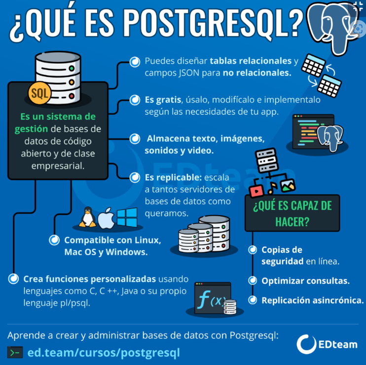
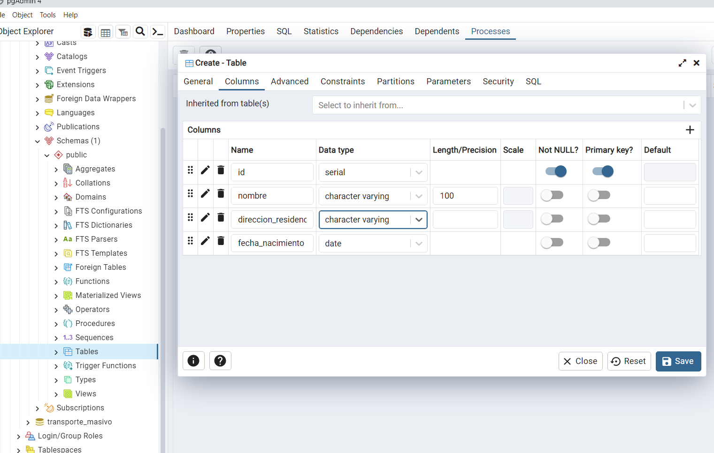

# CURSO DE PostgreSQL
##### Apuntes Curso Platzi 2024

[Link apuntes compañero](https://github.com/rb-one/Curso_PostgreSQL/blob/master/Notes/notes.md)

## Qué aprenderás sobre PostgreSQL


## ¿Qué es Postgresql?

Es un motor de base de datos: Permite estructurar toda la información dentro de un servidor, que es un equipo informático.

* Open source
* Objeto-Relacional
* Usa SQL
* Cumple estandar ACID Atomicidad, Consistencia, Aislamiento, Durabilidad

#### Por qué PostgreSQL
* Tipos de datos
* Integridad de datos
* Concurrencia, rendimiento
* Fiabilidad, recuperación ante desastres
* Seguridad
* Extensibilidad
* Internacionalización, busqueda de texto


## Interacción con Postgres desde la Consola

Hay 2 formas de acceder a PosgreSQL
    * Consola
    * PGAdmin

Para mostrar todos los comando en consola: \?

* Comando para ingresar a la BD:
\c
* Ayuda para ejecutar comando de SQL
* \h (te dice como se usan todos los comandos)
  
* ENTRAR A LA CONSOLA DE POSTGRES
psql -U postgres -W
* VER LOS COMANDOS \ DE POSTGRES
\?
* LISTAR TODAS LAS BASES DE DATOS
\l
* VER LAS TABLAS DE UNA BASE DE DATOS
\dt
* CAMBIAR A OTRA BD
\c nombre_BD
* DESCRIBIR UNA TABLA
\d nombre_tabla
* VER TODOS LOS COMANDOS SQL
\h
* VER COMO SE EJECTUA UN COMANDO SQL
\h nombre_de_la_funcion
* CANCELAR TODO LO QUE HAY EN PANTALLA
Ctrl + C
* VER LA VERSION DE POSTGRES INSTALADA, IMPORTANTE PONER EL ';'
SELECT version();
* VOLVER A EJECUTAR LA FUNCION REALIADA ANTERIORMENTE
\g
* INICIALIZAR EL CONTADOR DE TIEMPO PARA QUE LA CONSOLA TE DIGA EN CADA EJECUCION ¿CUANTO DEMORO EN EJECUTAR ESA FUNCION?
\timing
* LIMPIAR PANTALLA DE LA CONSOLA PSQL
Ctrl + L


* Verisión de la BD: select version();

* Volver a ejecutar el comando anterior: \g

* Optimizar la base de datos: \timing
    * Te dice cuanto tiempo demora en ejecutar la consulta.


## PgAdmin: Interacción con Postgres desde la Interfaz Gráfica

Usando la interfaz gráfica de PgAdmin

[LINK: Comandos de PosgreSQL](https://www.postgresqltutorial.com/wp-content/uploads/2018/03/PostgreSQL-Cheat-Sheet.pdf)


* Siempre usar el ; para separar consultas

## Archivos más importantes de Configuración
Directorio de instalación

* Archivos de configuración
    * postgresql.conf: Configuración general de postgres, múltiples opciones referentes a direcciones de conexión de entrada, memoria, cantidad de hilos de pocesamiento, replica, etc.
  
    * pg_hba.conf: Muestra los roles así como los tipos de acceso a la base de datos.
  
    * pg_ident.comf:  Permite realizar el mapeo de usuarios. Permite definir roles a usuarios del sistema operativo donde se ejecuta postgres.
  

* A través de la sentencia SHOW CONFIG se nos muestra donde están los archivos de configuración. En mi caso la ruta es: 
  
```SQL
show config_file;
"C:/Program Files/PostgreSQL/13/data/postgresql.conf"
```

## Comand más utilizados en PosgreSQL

    La Consola:

La consola en PostgreSQL es una herramienta muy potente para crear, administrar y depurar nuestra base de datos. podemos acceder a ella después de instalar PostgreSQL y haber seleccionado la opción de instalar la consola junto a la base de datos.

PostgreSQL está más estrechamente acoplado al entorno UNIX que algunos otros sistemas de bases de datos, utiliza las cuentas de usuario nativas para determinar quién se conecta a ella (de forma predeterminada). El programa que se ejecuta en la consola y que permite ejecutar consultas y comandos se llama psql, psql es la terminal interactiva para trabajar con PostgreSQL, es la interfaz de línea de comando o consola principal, así como PgAdmin es la interfaz gráfica de usuario principal de PostgreSQL.

Después de emitir un comando PostgreSQL, recibirás comentarios del servidor indicándote el resultado de un comando o mostrándote los resultados de una solicitud de información. Por ejemplo, si deseas saber qué versión de PostgreSQL estás usando actualmente, puedes hacer lo siguiente:

    1.SELECT VERSION();

Comandos de ayuda

En consola los dos principales comandos con los que podemos revisar el todos los comandos y consultas son:

\? Con el cual podemos ver la lista de todos los comandos disponibles en consola, comandos que empiezan con backslash ( \ )

2.png
\h Con este comando veremos la información de todas las consultas SQL disponibles en consola. Sirve también para buscar ayuda sobre una consulta específica, para buscar información sobre una consulta específica basta con escribir \h seguido del inicio de la consulta de la que se requiera ayuda, así: \h ALTER
De esta forma podemos ver toda la ayuda con respecto a la consulta ALTER


3.png
Comandos de navegación y consulta de información

\c Saltar entre bases de datos

\l Listar base de datos disponibles

\dt Listar las tablas de la base de datos

\d <nombre_tabla> Describir una tabla

\dn Listar los esquemas de la base de datos actual

\df Listar las funciones disponibles de la base de datos actual

\dv Listar las vistas de la base de datos actual

\du Listar los usuarios y sus roles de la base de datos actual

Comandos de inspección y ejecución

\g Volver a ejecutar el comando ejecutando justo antes

\s Ver el historial de comandos ejecutados

\s <nombre_archivo> Si se quiere guardar la lista de comandos ejecutados en un archivo de texto plano

\i <nombre_archivo> Ejecutar los comandos desde un archivo

\e Permite abrir un editor de texto plano, escribir comandos y ejecutar en lote. \e abre el editor de texto, escribir allí todos los comandos, luego guardar los cambios y cerrar, al cerrar se ejecutarán todos los comandos guardados.

\ef Equivalente al comando anterior pero permite editar también funciones en PostgreSQL

Comandos para debug y optimización

\timing Activar / Desactivar el contador de tiempo por consulta
Comandos para cerrar la consola

\q Cerrar la consola
Ejecutando consultas en la base de datos usando la consola

De manera predeterminada PostgreSQL no crea bases de datos para usar, debemos crear nuestra base de datos para empezar a trabajar, verás que existe ya una base de datos llamada postgres pero no debe ser usada ya que hace parte del CORE de PostgreSQL y sirve para gestionar las demás bases de datos.

Para crear una base de datos debes ejecutar la consulta de creación de base de datos, es importante entender que existe una costumbre no oficial al momento de escribir consultas; consiste en poner en mayúsculas todas las palabras propias del lenguaje SQL cómo CREATE, SELECT, ALTE, etc y el resto de palabras como los nombres de las tablas, columnas, nombres de usuarios, etc en minúscula. No está claro el porqué de esta especie de “estándar” al escribir consultas SQL pero todo apunta a que en el momento que SQL nace, no existían editores de consultas que resaltaran las palabras propias del lenguaje para diferenciar fácilmente de las palabras que no son parte del lenguaje, por eso el uso de mayúsculas y minúsculas.

Las palabras reservadas de consultas SQL usualmente se escriben en mayúscula, ésto para distinguir entre nombres de objetos y lenguaje SQL propio, no es obligatorio, pero podría serte útil en la creación de Scripts SQL largos.

Vamos ahora por un ligero ejemplo desde la creación de una base de datos, la creación de una tabla, la inserción, borrado, consulta y alteración de datos de la tabla.

Primero crea la base de datos, “CREATE DATABASE transporte;” sería el primer paso.


4.png
Ahora saltar de la base de datos postgres que ha sido seleccionada de manera predeterminada a la base de datos transporte recién creada utilizando el comando \c transporte.

5.png
Ahora vamos a crear la tabla tren, el SQL correspondiente sería:

CREATE TABLE tren ( id serial NOT NULL, modelo character varying, capacidad integer, CONSTRAINT tren_pkey PRIMARY KEY (id) );

La columna id será un número autoincremental (cada vez que se inserta un registro se aumenta en uno), modelo se refiere a una referencia al tren, capacidad sería la cantidad de pasajeros que puede transportar y al final agregamos la llave primaria que será id.

6.png
Ahora que la tabla ha sido creada, podemos ver su definición utilizando el comando \d tren

7.png
PostgreSQL ha creado el campo id automáticamente cómo integer con una asociación predeterminada a una secuencia llamada ‘tren_id_seq’. De manera que cada vez que se inserte un valor, id tomará el siguiente valor de la secuencia, vamos a ver la definición de la secuencia. Para ello, \d tren_id_seq es suficiente:

8.png
Vemos que la secuencia inicia en uno, así que nuestra primera inserción de datos dejará a la columna id con valor uno.

INSERT INTO tren( modelo, capacidad ) VALUES (‘Volvo 1’, 100);

9.png
Consultamos ahora los datos en la tabla:

SELECT * FROM tren;

10.png
Vamos a modificar el valor, establecer el tren con id uno que sea modelo Honda 0726. Para ello ejecutamos la consulta tipo UPDATE tren SET modelo = 'Honda 0726' Where id = 1;

11.png
Verificamos la modificación SELECT * FROM tren;

12.png
Ahora borramos la fila: DELETE FROM tren WHERE id = 1;

13.png
Verificamos el borrado SELECT * FROM tren;

14.png
El borrado ha funcionado tenemos 0 rows, es decir, no hay filas. Ahora activemos la herramienta que nos permite medir el tiempo que tarda una consulta \timing

15.png
Probemos cómo funciona al medición realizando la encriptación de un texto cualquiera usando el algoritmo md5:

    SELECT MD5('Vamos a encriptar un texto como el que lees');
               md5

16.png
La consulta tardó 10.011 milisegundos

## Tipos de datos
Principales:

    Numéricos
    Monetarios
    texto
    Binarios
    Fecha / Hora
    Boolean
    Especiales:

    Geométricos
    Dirección de Red
    Texto tipo bit
    XML, JSON
    Arreglos


## Diseñando nuestra base de datos: estructura de las tablas

## Jerarquía de Bases de Datos
Toda jerarquía de base de datos se basa en los siguientes elementos:

* Servidor de base de datos: Computador que tiene un motor de base de datos instalado y en ejecución.

* Motor de base de datos: Software que provee un conjunto de servicios encargados de administrar una base de datos.

* Base de datos: Grupo de datos que pertenecen a un mismo contexto.

* Esquemas de base de datos en PostgreSQL: Grupo de objetos de base de datos que guarda relación entre sí (tablas, funciones, relaciones, secuencias).

* Tablas de base de datos: Estructura que organiza los datos en filas y columnas formando una matriz.

**PostgreSQL es un motor de base de datos.**


La base de datos se llama transporte, usaremos su esquema predeterminado public.

El esquema public contiene las siguientes tablas:

    Estación

    Pasajero

    Tren

Y las tablas de relaciones entre cada uno de los elementos anteriores son:

    Trayecto

    Viaje

El esquema relacional entre las tablas corresponde al siguiente diagrama:

    Estación
Contiene la información de las estaciones de nuestro sistema, incluye datos de nombre con tipo de dato texto y dirección con tipo de dato texto, junto con un número de identificación único por estación.

    Tren
Almacena la información de los trenes de nuestro sistema, cada tren tiene un modelo con tipo de dato texto y una capacidad con tipo de dato numérico que representa la cantidad de personas que puede llevar ese tren, también tiene un ID único por tren.

    Trayecto
Relaciona los trenes con las estaciones, simula ser las rutas que cada uno de los trenes pueden desarrollar entre las estaciones

    Pasajero
Es la tabla que contiene la información de las personas que viajan en nuestro sistema de transporte masivo, sus columnas son nombre tipo de dato texto con el nombre completo de la persona, direccion_residencia con tipo de dato texto que indica dónde vive la persona, fecha_nacimiento tipo de dato texto y un ID único tipo de dato numérico para identificar a cada persona.

Viaje
Relaciona Trayecto con Pasajero ilustrando la dinámica entre los viajes que realizan las personas, los cuales parten de una estación y se hacen usando un tren.


## Creación de Tablas

* Serial nos ayuda a no usar int o begint, ademas ya es incremental
  
  


* CREANDO UNA TABLA
```SQL
CREATE TABLE public.pasajero
(
    id serial NOT NULL,
    nombre character varying(100),
    direccion_residencia character varying,
    fecha_nacimiento date,
    CONSTRAINT pasajero_pkey PRIMARY KEY (id)
);

ALTER TABLE IF EXISTS public.pasajero
    OWNER to postgres;


-- INSERTANDO DATOS EN LA TABLA

INSERT INTO public.pasajero(
	 nombre, direccion_residencia, fecha_nacimiento)
	VALUES ('Primer pasajero', 'Direcion x', '1995-06-15');
	
	SACAR FECHA DEL SISTEMA
	SELECT current_date;
	
```

* APUNTES DE TODAS LAS TABLAS


```SQL
CREATE TABLE pasajero(
	id serial,
	nombre character varying(100),
	direccion_residencia character varying,
	fecha_nacimiento date,
	CONSTRAINT pasajero_pkey PRIMARY KEY (id)
)
CREATE TABLE tren(
	id serial,
	modelo character varying(30),
	capacidad integer,
	CONSTRAINT tren_pkey PRIMARY KEY (id)
)
CREATE TABLE estacion(
	id serial,
	nombre character varying(30),
	direccion character varying(100),
	CONSTRAINT estacion_pkey PRIMARY KEY (id)
)
CREATE TABLE trayecto(
	id serial,
	id_tren integer,
	id_estacion integer,
	CONSTRAINT trayecto_pkey PRIMARY KEY (id),
	FOREIGN KEY (id_tren) REFERENCES estacion(id),
	FOREIGN KEY (id_estacion) REFERENCES tren(id)
)
CREATE TABLE viaje(
	id serial,
	id_pasajero integer,
	id_trayecto integer,
	inicio date,
	fin date,
	CONSTRAINT viaje_pkey PRIMARY KEY (id),
	FOREIGN KEY (id_pasajero) REFERENCES pasajero (id),
	FOREIGN KEY (id_trayecto) REFERENCES trayecto (id)
)
```


## Particiones

Ayudan a realizar consultas más rapidas.
No es necesario crear llaves

* Separación fisica de datos:
* Estructura de datos

**Crecando una partición en POSGRESQL**

```SQL
	CREATE TABLE bitacora_viaje201001 PARTITION OF bitacora_viaje
	FOR VALUES FROM ('2010-01-01') TO ('2019-01-31')

INSERT INTO public.bitacora_viaje(
	 id_viaje, fecha)
	VALUES (1, '2010-01-01');
```

## Creación de Roles

*   ¿Qué puede hacer un rol?
* Crear y eliminar
* Asignar atributos
* Agrupar otros roles
* Roles predeterminado

    \h create role
    Todas las opciones para crear rol

**Creando un USER O ROLE** 
PASOS A SEGUIR EN CONSOLA:

    create role usuario_consulta;
    Ver todos los Roles
    \dg

    alter role usuario_consulta with login;
    alter role usuario_consulta with superuser;
    alter role usuario_consulta with password '199524';
    


    


